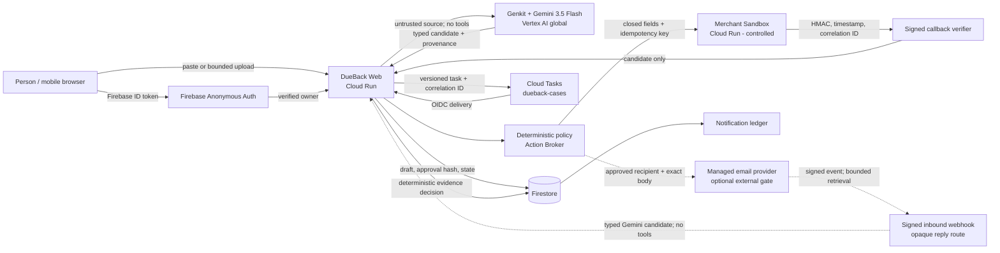

# DueBack Architecture and Trust Boundaries

Last verified: 2026-08-16. This diagram describes the implemented system, not a roadmap.

## Authority model

Gemini extracts typed candidates and citations. It has no action credentials and cannot authorize a
recipient, mutate a plan, advance lifecycle state, or declare completion. Approval binds owner,
case, plan version, canonical hash, and expiry. The Action Broker compares the proposed action to
that immutable boundary and derives one stable idempotency key.

The verifier—not Gemini—compares case identity, evidence level, amount, currency, transaction
reference, subject/bill period/tracking when applicable, freshness, issuer, and signature. An
acknowledgement stays open. `DONE` requires sufficient evidence.

## Trust boundaries

| Boundary                | Untrusted input                           | Enforced control                                                                                |
| ----------------------- | ----------------------------------------- | ----------------------------------------------------------------------------------------------- |
| Browser → product       | token, text, file, command                | Firebase verification, owner check, same-origin mutation, MIME/content and size limits          |
| Product → model         | uploaded source and embedded instructions | extractor has no tools; typed schema; provenance normalization; uncertainty blocks activation   |
| Task → worker           | duplicate or stale delivery               | Cloud Tasks OIDC, case version, bounded attempts, stable task name                              |
| Worker → counterparty   | proposed recipient, fields, action        | deterministic policy, approval expiry, closed adapter, idempotency ledger                       |
| Counterparty → callback | body, timestamp, replay, case claim       | separate HMAC secret, five-minute freshness, replay reservation, schema validation              |
| Email provider → inbound | signature, provider ID, body, attachments | original-body HMAC, event reservation, exact endpoint, 100 KB text bound, metadata-only attachments |
| Inbound text → model     | hostile email, prompt injection          | tool-less typed extraction; exact excerpts; sender/thread correlation before business decision |
| Candidate → lifecycle   | insufficient or mismatched evidence       | deterministic verifier; conflicts produce one intervention; terminal cases reject late evidence |
| Artifact access         | copied or modified link                   | HMAC grant bound to owner/case/artifact, maximum ten-minute lifetime                            |

## Durable state

Firestore stores plan drafts, case runs, action reservations/receipts, opaque message-thread
routes, evidence, interventions, notification records and their delivery projection, callback
replay reservations, daily security budgets, and deletion
tombstones. Cloud Tasks carries case ID, expected version, wake time, and correlation ID. Every
retry is bounded; a stale delivery is a no-op.

The deploy script enables Firestore TTL on a server-written `deleteAt` timestamp for user-visible
case data, evidence, events, budgets, model-usage records, and tombstones. Completion and explicit
expiry move the case-run deadline to 30 days; evidence and operational records receive their own
bounded deadline. Firestore TTL deletion is asynchronous and is not described as immediate erasure.

Before a Gemini call, a transaction reserves one of the four per-case call slots. Afterward, the
runtime records status, latency, input/output/total tokens when supplied by the provider, and a cost
estimate using the pinned standard-global price basis observed on 2026-08-16. Missing token usage
produces `null`, never a fabricated estimate.

Requested deletion removes the readable draft and case root transactionally, then removes its
subcollections and related notifications/interventions. The retained tombstone contains only
hashes, reason, request time, and purge time. The project does not claim forensic erasure or backup
deletion.

## Implemented limitations

- Merchant Sandbox is a separate, real HTTP service but not a real merchant.
- `MERCHANT_CONFIRMED` does not prove bank settlement, bill posting, shipment delivery, or receipt.
- Bidirectional managed-email code exists but is disabled unless a provider key, verified sender,
  inbound domain, webhook secret and controlled recipient-domain allowlist are configured. The
  deployed return channel is the durable case URL.
- The public MVP handles paste/upload. Gmail, WhatsApp, arbitrary browsing, banks, and production
  merchant integrations are not implemented. Gmail is a tested unavailable capability.
- A signed HTTPS partner fixture demonstrates adapter portability but is not a production partner.
- Bill-credit and replacement are contract/portability fixtures, not separate production channels.
